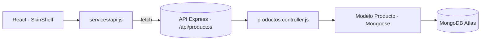

# PLAN.md — SkinShelf

## Objetivo

Mini aplicación fullstack para gestionar una **estantería de productos de skincare**: qué productos tengo, de qué marca, en qué momento del día los uso, cuándo los abrí, en qué estado están y qué puntuación les doy.

El objetivo académico es desarrollar un **CRUD completo de extremo a extremo** usando IA como apoyo, revisando y probando todo lo que genera.

## Alcance

**Dentro del alcance**

- Una entidad principal: `Producto`.
- CRUD completo desde la interfaz: listar, crear, editar y eliminar.
- Filtro por categoría y por estado.
- Backend Node + Express + MongoDB Atlas (Mongoose).
- Frontend React (Vite) + Tailwind, responsive.
- Despliegue: API en Render, frontend en Vercel.
- Pruebas de la API con `.http` y colección de Postman.

**Fuera del alcance (decisión consciente)**

- Autenticación de usuarios: no la pide la PEC y multiplicaría el trabajo sin aportar a la evaluación.
- Subida de imágenes: requiere almacenamiento externo; se sustituye por un campo de texto.
- Tests automatizados: se sustituyen por pruebas manuales documentadas (`.http` / Postman).

## Entidad y campos

**`Producto`**

| Campo | Tipo | Obligatorio | Validación / valor por defecto |
|---|---|---|---|
| `nombre` | String | Sí | `trim`, máx. 80 caracteres |
| `marca` | String | Sí | `trim` |
| `categoria` | String | Sí | enum: `limpiador`, `tonico`, `serum`, `hidratante`, `protector solar`, `mascarilla`, `tratamiento` |
| `ingredienteClave` | String | No | Texto libre (ej. "niacinamida 5%") |
| `momentoUso` | String | No | enum: `mañana`, `noche`, `ambos` · por defecto `ambos` |
| `precio` | Number | No | `min: 0` · por defecto `0` |
| `fechaApertura` | Date | No | — |
| `estado` | String | No | enum: `sin abrir`, `en uso`, `terminado` · por defecto `sin abrir` |
| `puntuacion` | Number | No | entre 1 y 5 |
| `notas` | String | No | máx. 300 caracteres |
| `createdAt` / `updatedAt` | Date | Auto | `timestamps: true` |

## Endpoints

| Método | Ruta | Descripción |
|---|---|---|
| `GET` | `/` | Estado de la API |
| `GET` | `/api/productos` | Lista (admite `?categoria=` y `?estado=`) |
| `GET` | `/api/productos/:id` | Un producto |
| `POST` | `/api/productos` | Crear |
| `PUT` | `/api/productos/:id` | Actualizar |
| `DELETE` | `/api/productos/:id` | Eliminar |

## Arquitectura

## Fases

1. **Planificación** — idea, entidad, campos y convenciones (`PLAN.md`, `AGENTS.md`).
2. **Backend** — modelo, conexión a Atlas, controlador CRUD, rutas, middlewares 404/500, variables de entorno.
3. **Pruebas de API** — `requests.http` y colección de Postman, incluyendo casos que deben fallar.
4. **Frontend** — servicio de API, listado, formulario reutilizable (crear/editar), eliminación con confirmación, filtros y responsive.
5. **Revisión crítica** — auditoría del código generado, corrección de errores, explicación línea a línea de las partes clave.
6. **Despliegue** — Atlas + Render + Vercel, CORS de producción.
7. **Documentación** — README con uso de IA, prompts, errores encontrados y reflexión.

## Decisiones principales

| Decisión | Alternativa descartada | Motivo |
|---|---|---|
| Entidad "producto de skincare" | Reutilizar la idea de viajes (Vagamundo) | La PEC pide un proyecto distinto y esta entidad tiene campos variados (enums, fecha, número, rango) que obligan a trabajar validaciones de verdad. |
| CommonJS en el backend | ESM | Es lo visto en la asignatura y evita problemas de configuración en Render. |
| `fetch` nativo en el frontend | axios | Una dependencia menos y es lo que pide la asignatura. |
| Tailwind | CSS a mano | Permite centrarse en la lógica y hacer el responsive rápido. |
| Render para la API | Vercel serverless | Una API Express con conexión persistente a Mongo encaja mejor en un servicio siempre activo. |
| Validaciones en modelo **y** en formulario | Solo en el frontend | La validación de cliente es comodidad; la de servidor es la que protege los datos. |

## Riesgos identificados

- **Desajuste de enums entre frontend y backend** → mitigado definiendo las listas una sola vez en `PLAN.md` y copiándolas literalmente a ambos lados.
- **Credenciales de Atlas en el repositorio** → mitigado con `.env` + `.gitignore` y revisión manual antes de cada commit.
- **CORS al desplegar** → previsto configurar el origen permitido antes del despliegue, no después.
